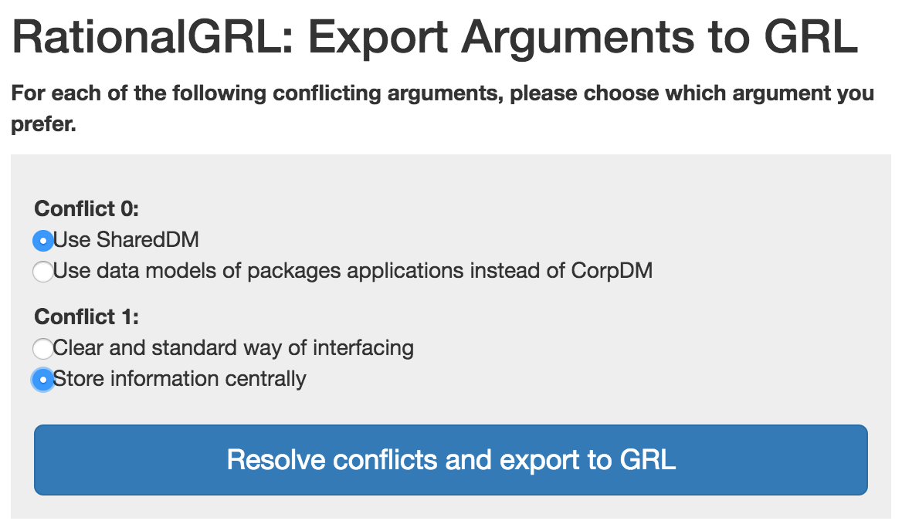

# Tool Overview

The tool can be found here: http://www.marcvanzee.nl/RationalGRL/
This is a screenshot of the main screen:

Input:
* Radio: The user can choose how to resolve conflicts. If two arguments that are related to GRL elements are in bi-directional conflict, they have to be resolved. This is because it is not possible to have bi-directional attacks in GRL. The user can either not export them at all (i.e., whenever there is a bi-directional attack, don't export any of them), export them arbitrarily, or choose themselves how to export.
* Export evaluation: If this is unchecked, the tool will only export the GRL model in XML format. Otherwise, the tool will also export an evaluation of the GRL model in CSV format, based on the evluation of the arguments.

# Resolving conflicts

If the user chooses to resolve conflicts themselves, then the following dialog may pop up:

Here, the user can select which arguments he/she prefers.

# Importing from Argument Web / Exporting to GRL

More details on the procedure can be found in the [main directory of this project](../)